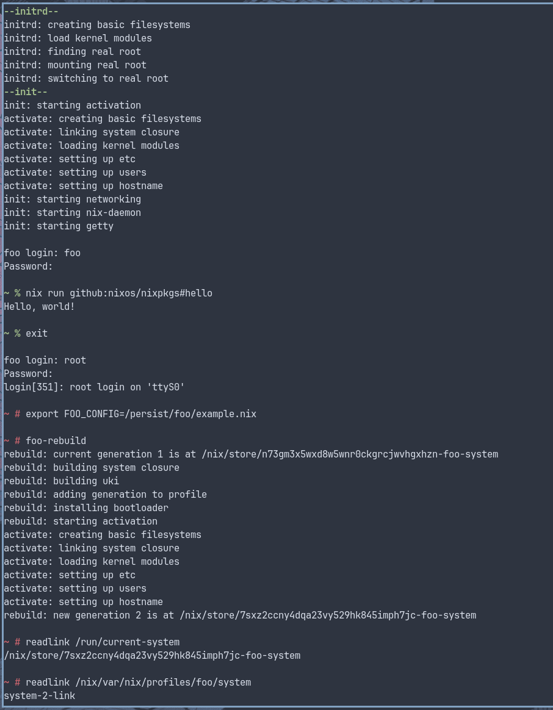

# foo

A Nix-based operating system.

foo, pronounced /fuː/, is an operating system designed around
[Nix](https://github.com/nixos/nix) and
[Nixpkgs](https://github.com/nixos/nixpkgs).

foo does not provide a module system. Instead, it exposes a single function,
`buildFoo`, which takes a configuration attrset containing a set of well-known
attributes. Composition and merging are intentionally left to the caller and can
be implemented using normal Nix expressions.

foo is mainly intended for my own personal use.

The configuration options provided by foo are intentionally primitive:

1. Kernel packages.
2. Kernel modules to include in the initrd.
3. Commands to run in the initrd.
4. Commands to run as init (PID 1).
5. Paths and artifacts to include in the system closure.

Anything beyond these primitives is built on top of foo.

foo produces a UKI containing the provided kernel and initrd, and exposes a
toplevel closure containing the init script and any additional artifacts. By
default, only the init script is included.

To produce an options doc (markdown):

```bash
nix eval -f example.nix build.optionsMd --raw
```

This also available in [options.md](./options.md). Options are not validated or
checked.

An example is provided which uses foo to build a minimal system with:

1. NixOS-like activation and system closure
2. /etc as a erofs overlay
3. Multi-user Nix package manager

To build the example:

```bash
nix build -f example.nix build.diskImage
```

This can be booted with QEMU.


